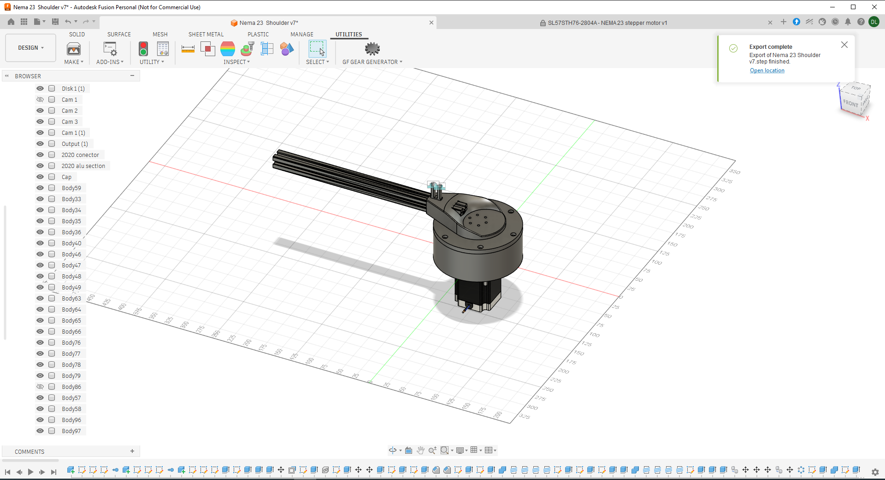
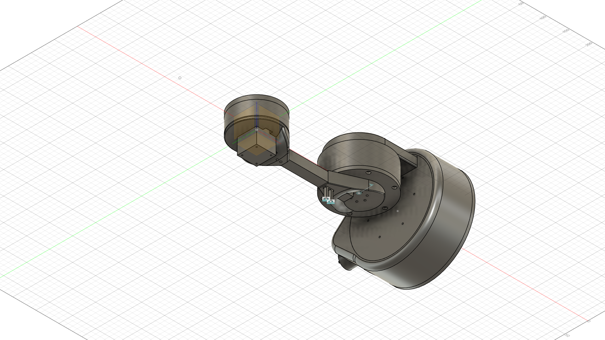
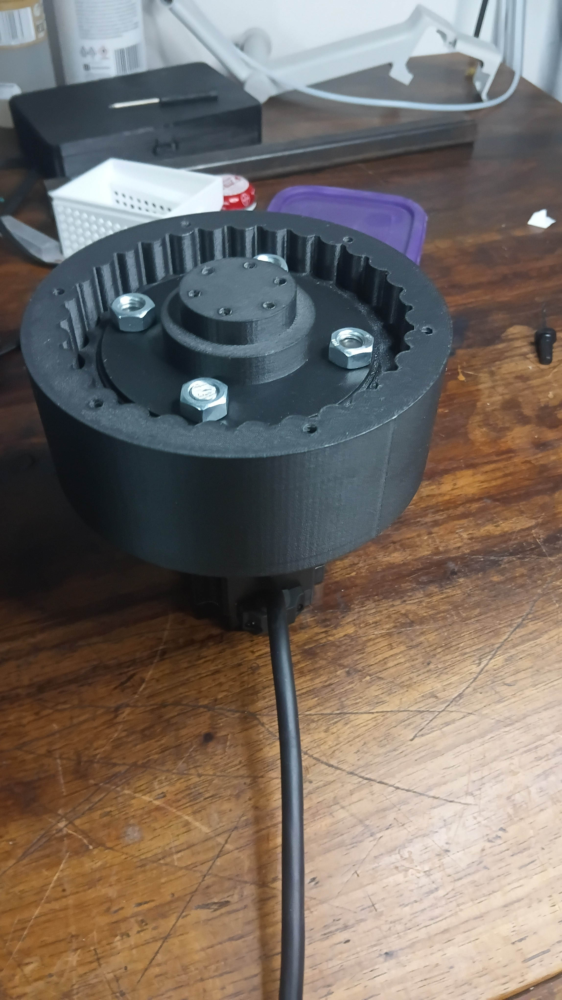
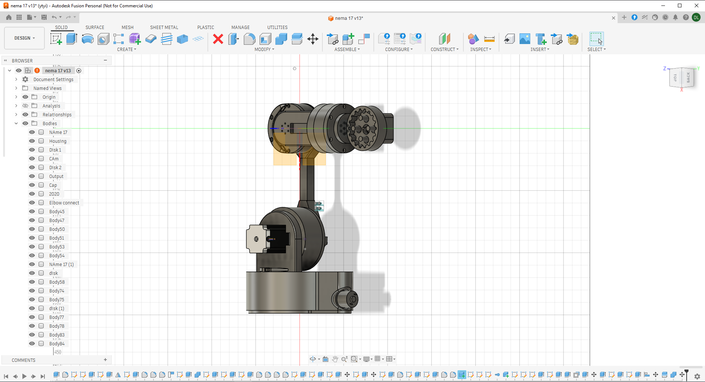

# ArmBrain-J2
Shoulder joint for my 6-Dof robot arm- Stardance submission 
# ArmBrain J2 - NEMA23 Robotic Shoulder Joint

180° pitch joint for a 6-DOF robot arm. Built for Hack Club Stardance Challenge 2026.

**Demo video:** [https://www.youtube.com/watch?v=yK_z2fAlV0k&t=17s&pp=0gcJCT8LAYcqIYzv]

## Specs
- **Motor:** NEMA23 stepper
- **Driver:** TB6600 stepper driver 
- **Bearing:** thin-section bearing for zero backlash
- **Controller:** Arduino Uno R3
- **Material:** PETG-CF + Aluminum

## NASA Connection
Next step: Integrate Artemis mission trajectory data for inverse kinematics simulations. Goal is satellite assembly task practice.

## Files
- `Nema 23 Shoulder v7.step` - CAD for manufacturing/review
- `/photos` - Build pictures coming soon
- `nema 17 v13.step` - This is the full almoste done arm
- 

## Status
✅ Working prototype - 90°ramp motion tested  
🔧 J1 base + J3 elbow in progress
 J5 almost done J1-J4 are complete, sill have to print J1,J3,J4,J5

Built by @Denni112-glitch | Stardance 2026
